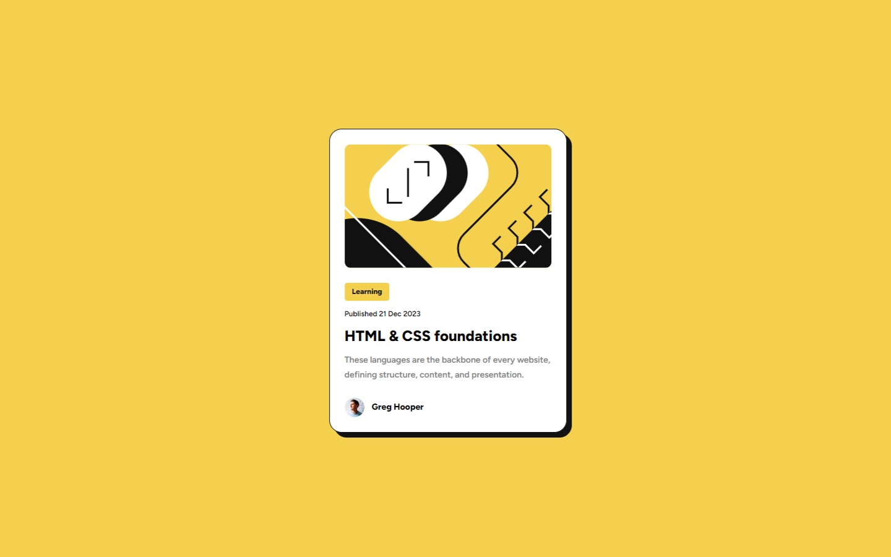
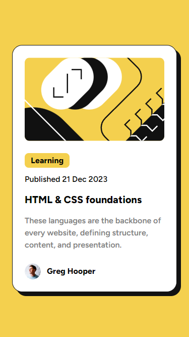
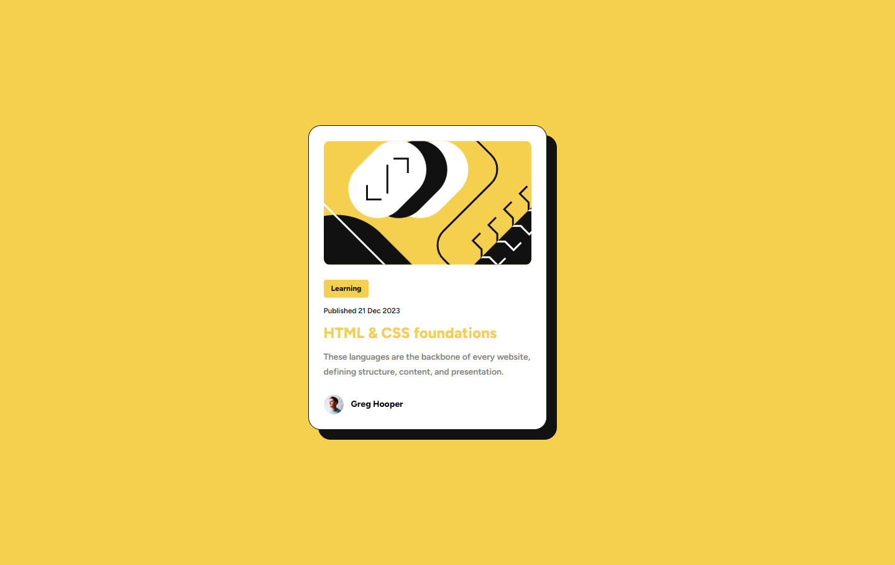

# Frontend Mentor - Blog preview card solution

This is a solution to the [Blog preview card challenge on Frontend Mentor](https://www.frontendmentor.io/challenges/blog-preview-card-ckPaj01IcS).

## Table of contents

- [Overview](#overview)
  - [The challenge](#the-challenge)
  - [Screenshot](#screenshot)
  - [Links](#links)
- [Built with](#built-with)
- [Author](#author)

## Overview

### The challenge

Users should be able to:

- See hover and focus states for all interactive elements on the page

### Screenshot

### Links

- [Solution Repo](https://github.com/samilaug/blog-preview-card-challenge)
- [Live Site](https://samilaug.github.io/blog-preview-card-challenge/)

## My process

### Built with

- Semantic HTML5 markup
- CSS custom properties
- Flexbox
- Mobile-first workflow

## Author

<!-- - Website - [Add your name here](https://www.your-site.com) -->
- Frontend Mentor - [@samilaug](https://www.frontendmentor.io/profile/samilaug)
- Linkedin - [samila-gunarathna](https://www.linkedin.com/in/samila-gunarathna/)
<!-- - Twitter - [@yourusername](https://www.twitter.com/yourusername) -->
